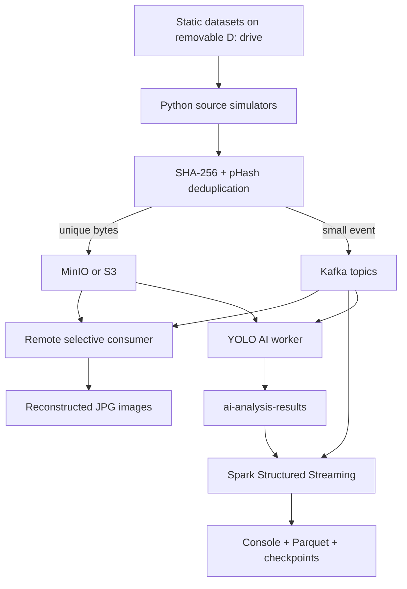

# Architecture

## Current implementation

Layer responsibilities are intentionally separate:

- **Layer 1 - data source:** discovers static CrisisMMD, ISBDA, and xBD files and emits them slowly to simulate live arrival.
- **Layer 2 - ingestion:** Kafka buffers and transports events. It does not perform AI or downstream analytics.
- **Layer 3 - processing:** Spark parses explicit schemas, validates each modality, normalizes social text, performs demonstration counts, preserves Kafka metadata, and produces AI-ready metadata.
- **Layer 4 - AI:** preprocesses unique drone frames and runs the preserved YOLOv8 damage detector.
- **Layer 5 - frontend:** controls the pipeline and visualizes model metrics and live inference results.

## Event contracts

| Topic | Payload | Layer 3 output |
| --- | --- | --- |
| `social-posts` | Text, hazard, event, source timestamp | Normalized text, keyword flag, Kafka metadata |
| `drone-video` | Base64 fallback or object URI; checksum and duplicate metadata | Unique frame `ready_for_ai` or `duplicate_skipped` |
| `satellite-imagery` | Base64 fallback or object URI for converted JPEG | Unique image `ready_for_ai` or exact `duplicate_skipped` |
| `gis-data` | Reserved | Future |
| `ai-analysis-results` | Detection classes, confidences, boxes, and status | Durable AI Parquet records |

The interactive consumer reconstructs Base64 content or downloads the object reference. Spark deliberately removes `image_data` and temporary signed URLs before writing Parquet, preventing large or expiring fields from polluting metadata storage.

## Image transfer and canonicalization

`IMAGE_TRANSFER_MODE=object_storage` is the efficient path. A unique image is uploaded to MinIO/S3 under a checksum-derived key. Kafka receives the durable `image_uri`, `object_key`, byte size, SHA-256 checksum, and a temporary download URL. The consumer and AI layer retrieve the image only when needed.

The fingerprint registry uses SQLite for this single-host capstone:

- SHA-256 finds byte-identical images across restarts.
- pHash compares recent images from configured sources and tolerates recompression/resizing.
- the first accepted image becomes canonical;
- later duplicates carry `canonical_image_id` and no image bytes/reference upload;
- duplicate Kafka events preserve provenance and allow prior AI output reuse.

Satellite pHash suppression is off by default because small before/after changes may be the disaster signal. A production multi-producer deployment would move fingerprint state to a shared database and approximate-nearest-neighbor index.

## Distributed data flow

The Windows host runs ZooKeeper, Kafka, MinIO, and producers. Kafka advertises the address from `KAFKA_ADVERTISED_HOST`. A second Windows, macOS, or Linux device uses that address for the consumer, Spark, or AI layer. Same-LAN testing uses the Wi-Fi IPv4. Internet-separated teammates use the host's stable private Tailscale `100.x.x.x` address for both Kafka and MinIO.

`localhost` always means “this device.” Therefore it is correct only for a one-system test. A second computer uses `<REACHABLE_HOST_IP>:9092` for Kafka and `http://<REACHABLE_HOST_IP>:9000` for object storage.

## Fault tolerance

Kafka retains ordered topic partitions. Spark stores offsets and query state under `storage/checkpoints/<modality>`. Restarting the same query against the same checkpoint continues from the recorded progress. The source processors skip malformed records and unreadable images; Kafka/Spark errors include connection context in logs.

## Production evolution

Base64 remains useful for a first capstone smoke test. The implemented object-storage mode is the preferred remote path: MinIO provides a local S3-compatible demonstration, while the same code can point to AWS S3 for durable availability. A production broker should also enable TLS and authentication.

Future interfaces naturally attach after each topic-specific Spark processor:

- normalized social text -> NLP classifier or text embedding service;
- drone frame reference -> damage/fire/flood computer vision service;
- satellite image reference -> change detection and affected-area model.

Embeddings belong in the AI/processing layer, not inside the Kafka broker. Kafka transports embedding events if needed, but does not generate them.
