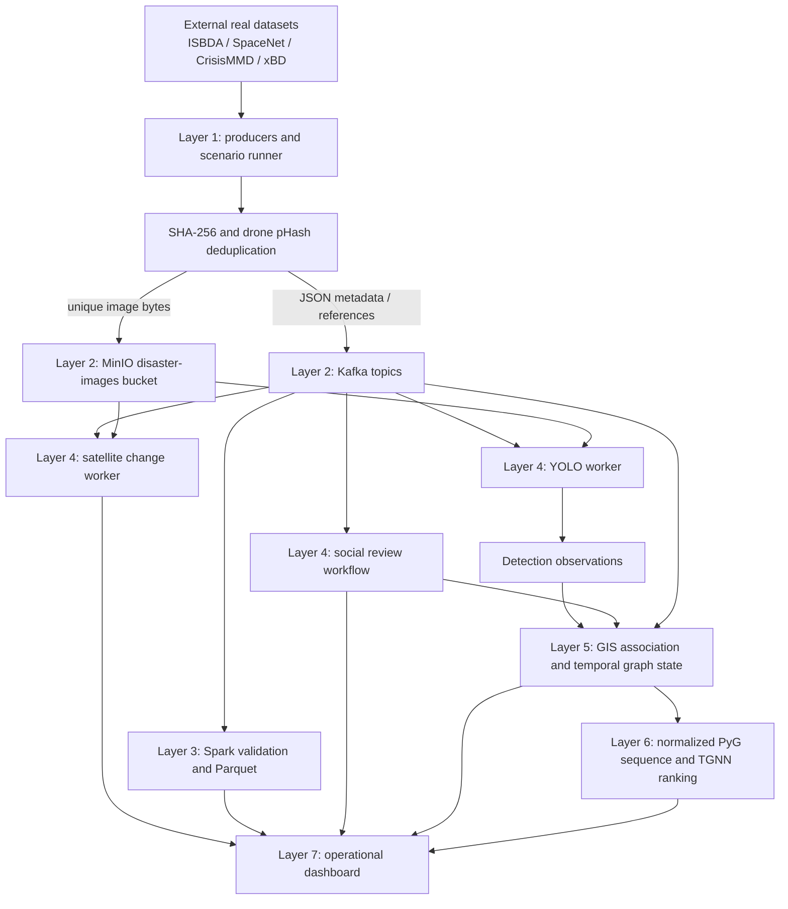

# Final system documentation

Status date: 2026-09-26  
Canonical scenario: `louisiana-east-flood-v1`  
Reference branch: `dibsei/baseline-blocker-fixes`

This is the authoritative technical and operating document for the current
repository. The other files under `docs/` preserve focused design notes and
test evidence; when descriptions differ, the implemented contracts and the
boundaries stated here take precedence.

## 1. Problem and objectives

Post-disaster assessment data arrives from different sources, at different
rates, with different geographic precision and different levels of trust. Raw
drone images, satellite imagery, social reports, and infrastructure telemetry
cannot safely be treated as equivalent evidence or pushed directly into one
model.

This system demonstrates a layered response pipeline that can:

- ingest heterogeneous disaster observations through stable Kafka contracts;
- store large image bytes outside Kafka in S3-compatible MinIO;
- remove exact and near-duplicate image work while retaining an audit event;
- process and persist stream metadata with Spark Structured Streaming;
- run checkpoint-backed drone damage detection;
- calculate broad-area satellite change without conflating it with damage;
- associate observations with stable GIS IDs and graph node IDs;
- maintain immutable, explainable temporal graph snapshots;
- rank infrastructure nodes with a committed TGNN checkpoint;
- hold social distress reports for responder confirmation or rejection; and
- present provenance, freshness, evidence, state, and risk in one dashboard.

The project is a controlled capstone demonstration. It is not a certified
emergency-management system, a field-validated damage model, or an autonomous
dispatch system.

## 2. Layer-by-layer architecture



| Layer | Responsibility | Does not do |
|---|---|---|
| 0. Assets | Registers checksums, provenance, footprints, timestamps, and expected scenario effects | Does not claim simulated context is measured reality |
| 1. Sources | Reads datasets or scenario definitions and emits production-shaped events | Does not inject final dashboard/model output |
| 2. Transport | Kafka orders metadata events; MinIO stores image bytes | Does not perform analytics |
| 3. Stream processing | Spark validates schemas, normalizes records, preserves Kafka metadata, and writes Parquet/checkpoints | Does not invent detections or risk |
| 4. Modality analysis | YOLO, deterministic social resolution/review, and satellite change produce distinct evidence | Does not merge incompatible evidence semantics |
| 5. GIS and graph state | Resolves stable IDs, applies observations/telemetry, propagates declared dependencies, and records before/after state | Does not mutate the frozen GIS baseline |
| 6. TGNN | Converts ordered snapshots to validated tensors and ranks nodes | Does not produce calibrated failure probabilities |
| 7. Presentation | Combines available evidence into an operator-facing common picture | Does not bypass upstream contracts |

## 3. Component responsibilities

| Component | Primary implementation | Responsibility |
|---|---|---|
| Configuration | `config/settings.py` and `.env` | Central environment-backed settings and paths |
| Topic registry | `common/topics.py` | Canonical topic names |
| Object storage | `common/object_storage.py` | Bucket creation, uploads, downloads, and presigned URLs |
| Image transport | `common/image_transfer.py` | Base64 or object-reference event attachment |
| Persistent deduplication | `common/deduplication.py` | SHA-256, pHash, canonical IDs, SQLite state |
| Normal producers | `data_source/*/*_producer.py` | Dataset discovery and event publication |
| Scenario runner | `scenario_runtime/` and `scripts/run_scenario.py` | Start, pause, resume, reset, speed, clock, and production-contract replay |
| Spark | `spark/spark_streaming.py` and modality processors | Schema validation, normalization, console/Parquet output, checkpointing |
| YOLO | `ai/computer_vision/worker.py` | Retrieve unique drone image, preprocess, infer, publish results |
| Satellite change | `core/satellite/change_worker.py` | Pair pre/post tile events and publish coarse radiometric change |
| Social workflow | `core/nlp/` | Deterministic text/GIS resolution, deduplication, review state, audit |
| GIS | `core/gis/` | Load/reproject geometry, spatial lookup, persistent manual classifications |
| Graph state | `core/graphs/` and `core/observation/` | Stable topology, observations, telemetry, freshness, cascade, recovery |
| TGNN | `core/integration/` and `tgnn/` | PyG bridge, checkpoint validation, stable node-to-risk mapping |
| Dashboard | `dashboard/server.py`, services, and `dashboard/static/` | Process controls, scenario controls, map, evidence, risk, and audit UI |

## 4. Data contracts and Kafka topics

All topics are created with three partitions and replication factor one in the
local stack.

| Topic | Producer | Required meaning | Main consumers |
|---|---|---|---|
| `social-posts` | Social producer or scenario runner | Text report with source identity, hazard/event, timestamp, and optional scenario/GPS provenance | Spark, social review, dashboard |
| `drone-video` | Drone producer or scenario runner | Drone image envelope or canonical duplicate event | Spark, YOLO worker |
| `satellite-imagery` | Satellite producer or scenario runner | JPEG representation of a source TIFF; scenario pairs add phase, tile, bbox, and reference counts | Spark, change worker |
| `gis-data` | GIS imagery producer | Reserved GIS raster/image envelope | Spark/selective consumer; not the frozen structural graph source |
| `ai-analysis-results` | YOLO worker | Live checkpoint result, detections, image lineage, and provenance | Spark, observation/GIS adapter, dashboard |
| `infrastructure-telemetry` | Scenario runner or future sensor adapter | Validated target, load, capacity, damage, event type, and timestamp | Graph-state adapter, dashboard |
| `satellite-change-results` | Satellite change worker | Source pair, WGS84 footprint, change grid, summary, and reference counts | Dashboard only |

### 4.1 Common image envelope

A unique image contains its source identifier (`frame_id`, `image_id`, or
`map_id`), `timestamp`, `source`, `data_type=image`, format, `transfer_mode`,
`size_bytes`, `content_hash`, and `is_duplicate=false`.

- In `base64` mode, `image_data` contains ASCII Base64.
- In `object_storage` mode, `object_key`, durable `image_uri`, and temporary
  `download_url` point to MinIO/S3.
- A duplicate has `transfer_mode=none`, `is_duplicate=true`,
  `canonical_image_id`, `canonical_content_hash`, `duplicate_method`, optional
  `perceptual_distance`, and `processing_status=duplicate_skipped`. It does not
  upload or retransmit image bytes.

Scenario image events additionally carry `scenario_id`, `scenario_event_id`,
`scenario_timestamp`, `input_origin`, and `simulation_fields`. Drone scenario
events include assigned `gps`, `target_id`, `asset_id`, and the official
annotation's primary class. These assignments are explicitly simulated.

### 4.2 YOLO result contract

`ai-analysis-results` records one of `analyzed`, `filtered`,
`duplicate_skipped`, or `error`. An analyzed record contains:

- source frame, timestamp, object reference, transfer mode, and content hash;
- model name and checkpoint SHA-256;
- `inference_provenance=live-checkpoint-inference` and
  `prerecorded_output=false`;
- detection count, maximum confidence, damage classes, and preprocessing data;
- per-detection `class_id`, `class_name`, confidence, and XYXY box; and
- scenario time, GPS provenance, declared target provenance, and image lineage.

### 4.3 Telemetry contract

Telemetry requires `id`, finite epoch `timestamp`, stable GIS `target_id`,
non-negative `load`, positive `capacity`, and `damage` in `[0,1]`.
`event_type` is optional for normal inputs and identifies explicit recovery or
restoration events when damage is allowed to decrease. Stale and conflicting
same-time events are rejected.

### 4.4 Spark outputs

Spark removes large Base64 fields and expiring signed URLs before persistence.
Validated records and Kafka metadata are written under:

```text
storage/processed/social/
storage/processed/drone/
storage/processed/satellite/
storage/processed/gis/
storage/processed/ai/
storage/checkpoints/<modality>/
```

## 5. MinIO structure

The default bucket is `disaster-images`. Unique objects use a deterministic
checksum-derived key:

```text
disaster-images/
  drone/<sha256-first-2>/<sha256>_<original-name>.jpg
  satellite/<sha256-first-2>/<sha256>_<source-stem>.jpg
  gis/<sha256-first-2>/<sha256>_<original-name>.<ext>
```

Kafka stores `s3://disaster-images/<key>` as the durable URI. Presigned HTTP
URLs expire and are convenience fields only. MinIO is selected because it
implements the S3 API locally, avoids Base64's roughly 33% expansion, keeps
large bytes out of Kafka/Parquet, and permits later migration to managed S3
without changing the event shape.

The local MinIO console is `http://localhost:9001`; credentials come from
`MINIO_ROOT_USER` and `MINIO_ROOT_PASSWORD` in `.env`. Do not expose the
development credentials publicly.

## 6. GIS and coordinate-reference-system design

The scenario structural source is the frozen OSM-derived GeoJSON at
`scenarios/louisiana_east_flood/gis/infrastructure.geojson`. It contains five
roads and sixteen buildings. Stable OSM source IDs are preserved and mapped to
stable integer graph rows. The frozen file is never modified by runtime state
or manual classifications.

Input and browser output use WGS84 longitude/latitude (`EPSG:4326`). The loader
chooses one local UTM CRS from the dataset midpoint and reprojects all accepted
geometry exactly once. For the Louisiana scenario this is UTM zone 15N,
`EPSG:32615`. Distances, containment, centroids, nearest-neighbor association,
and graph geometry use metres in that working CRS. Conversion back to WGS84
occurs only at the presentation boundary.

Association is deterministic:

1. Validate finite WGS84 coordinates and project them to the scenario CRS.
2. If the point is covered by one or more buildings, select the smallest
   footprint; stable GIS ID breaks equal-area ties.
3. Otherwise select the nearest road within an inclusive 150 m radius;
   stable GIS ID breaks equal-distance ties.
4. Return no association when no candidate qualifies.
5. Store image/content hash, detection index, association method and distance,
   GIS source ID, and integer graph node ID in the observation log.

Manual building types are stored as append-only revisions in
`storage/gis/building_classifications.sqlite3` with building source ID,
assigned type, operator, timestamp, notes, and history. They survive an
application restart but do not alter the raw GeoJSON.

## 7. Analysis and inference flows

### 7.1 Drone and YOLO

```text
ISBDA JPEG
  -> SHA-256 exact check
  -> drone-only pHash near-duplicate check
  -> MinIO object + drone-video event
  -> validation/resize/motion/quality preprocessing
  -> committed YOLO26s checkpoint
  -> ai-analysis-results
  -> detection observation
  -> GIS source ID and graph node ID
```

The first image becomes canonical. SHA-256 catches byte-identical replays;
pHash catches visually equivalent recompressions/resizes within the configured
Hamming threshold. Satellite pHash is disabled because small pre/post changes
may be the signal.

The serving checkpoint recognizes `Slight`, `Severe`, and `Debris`. Its SHA-256
is `780241f6b42f9f0b0d83a8be8d3168e1ca864a756ff93907e72bbb7f9fe3cbf9`.
Recorded training metrics are precision 0.3692, recall 0.2820, mAP50 0.2517,
and mAP50-95 0.1087. These modest metrics are an explicit limitation.

### 7.2 Social/NLP and responder review

```text
social-posts
  -> validate and normalize
  -> exact source/fingerprint duplicate or contradiction check
  -> distress phrase and negation patterns
  -> name match or type-hint-nearest GIS resolution
  -> INCOMING -> PENDING_REVIEW
  -> responder CONFIRMED or REPORTED_FALSE
```

This is deterministic pattern, keyword, fuzzy-name, and GIS lookup logic. It is
not an LLM or a trained general classifier. Pending reports create no hotspot
and no graph observation. Confirmation creates one orange, auditable,
GIS-linked human-evidence hotspot/observation. Rejection remains auditable and
does not affect confirmed state. Social observations never modify structural
damage and are not TGNN features.

### 7.3 Satellite change

```text
real SpaceNet pre/post TIFFs
  -> producer normalization to JPEG
  -> MinIO + satellite-imagery
  -> pair by scenario ID and tile ID
  -> aligned WGS84 overlap
  -> 8 x 8 radiometric-difference grid
  -> satellite-change-results
  -> dashboard panel only
```

The result includes source references, timestamp, footprint, per-cell severity,
summary counts, and official reference counts. It is uncalibrated radiometric
change—not flood segmentation, building destruction probability, or a TGNN
feature.

### 7.4 Graph state, cascade, and recovery

The baseline NetworkX graph is immutable; every event produces a deep-copied
snapshot. A node stores damage, load, nominal/effective capacity, utilization,
stress, status, state timestamp, last observation, and freshness.

```text
intrinsic capacity = capacity * (1 - damage)^1.5
effective capacity = intrinsic capacity * dependency factor
utilization        = load / capacity
stress             = min(1, load / effective capacity)
```

Dependency edges are directed provider-to-dependent edges with `edge_type=1`.
Failure lowers dependent capacity/stress/status through a fixed-point pass but
never copies physical damage. Explicit recovery may reduce load and damage.
Missing observations remain marked missing; observations older than 30 minutes
are stale; neither silently overwrites newer state.

The Louisiana graph contains 21 nodes, 322 spatial edges, and zero functional
dependency edges. Therefore its visible high-risk cluster is spatial/model
context, not a demonstrated physical cascade. Dependency propagation is tested
only with a synthetic power-to-telecom-to-social fixture.

### 7.5 TGNN

Ordered oldest-to-newest NetworkX snapshots are converted to PyTorch Geometric
objects with a stable node order. The tensor feature order is:

```text
x_pos, y_pos, load, capacity, damage, stress, status
```

The first six values are model inputs; `status` was the next-timestep training
target. One extent across the complete temporal sequence normalizes only
`x_pos` and `y_pos` to `[0,1]`. Node/edge counts, finite values, edge attributes
`[weight, delay, edge_type]`, and stable ID mapping are validated before
inference.

The TGNN checkpoint SHA-256 is
`ad40a02e91cfe414da23f585dcf237d7fd2b5f646f3ebc47c20cb7d73640cc88`.
Training encoded operational as 1 and failed as 0. The dashboard reports
`sigmoid(-logit)` as a relative failure-risk ranking. It is finite and useful
for ordering/comparing scenario states, but it is not calibrated probability.

## 8. Frozen scenario timeline

Scenario time begins at `2026-09-24T12:00:00Z`. Twelve milestones publish
eight input records: two satellite, three drone, one social, and two telemetry
records. Derived milestones are calculated by consumers, not injected.

| # | Offset | Event | Input/target | Expected visible effect |
|---:|---:|---|---|---|
| 1 | 0 s | Baseline GIS loaded | Frozen graph | 21 nodes, 322 edges, zero damage |
| 2 | 30 s | Satellite change | SpaceNet tile `2_23_44` | Separate broad-area panel; graph unchanged |
| 3 | 60 s | First drone image | Estuary Road | Slight-damage detections with simulated GPS badge |
| 4 | 90 s | Severe/debris images | Building and Ditcharo Street | Additional independent observations |
| 5 | 120 s | Social distress arrives | Alert plus candidate nodes | Pending queue; no hotspot |
| 6 | 135 s | Responder confirms | Social alert | Orange hotspot and auditable human observation |
| 7 | 150 s | Telemetry degrades | Estuary Road | Staged load 0.72, capacity 0.8, damage 0.35 |
| 8 | 180 s | Graph snapshot | Accepted evidence | Recomputed capacity, utilization, stress, status |
| 9 | 210 s | TGNN recalculation | Ordered snapshots | All-node risk layer, top five, highest marker |
| 10 | 240 s | Spatial risk pattern | Risk plus spatial edges | Model-derived cluster, not claimed cascade |
| 11 | 300 s | Recovery arrives | Estuary Road | Load 0.44, damage 0.15, restored state |
| 12 | 330 s | Risk refresh | Sequence through recovery | Refreshed ranking and risk deltas |

The runner supports start, pause, resume, reset, speed changes, current
simulation time/event, and completed/upcoming events.

## 9. Real-versus-simulated matrix

| Item | Real/data-backed | Simulated/model-derived | Correct interpretation |
|---|---|---|---|
| Structural GIS | Frozen OSM roads/buildings and coordinates | Runtime state | Real geometry with scenario state layered on top |
| Drone imagery | Three real ISBDA images and official annotations | Louisiana GPS, target IDs, event time | Real image evidence placed into a simulated local story |
| YOLO result | Real committed-checkpoint execution | Model inference itself | Measured model output, not ground truth |
| Satellite imagery | Real SpaceNet pair and reference labels | Scenario timestamp | Dataset-backed broad-area source |
| Satellite change | Real processing of transported pair | Model-derived grid/severity | Radiometric evidence, not damage probability |
| Social report | None in frozen scenario | Text, position, target, time, decision | Workflow demonstration, not a real public report |
| Telemetry/recovery | None in frozen scenario | All readings and times | State/cascade/recovery demonstration |
| GIS association | Real deterministic code and frozen geometry | Assigned drone/social coordinates | Traceability validation, not camera geolocation accuracy |
| Graph state | Implemented formulas and immutable snapshots | Scenario inputs | Explainable simulated evolution |
| TGNN | Real checkpoint execution and stable mapping | Synthetic-training-derived scores | Relative ranking, not probability |
| Dashboard | Real services and retrieved results | Combined scenario presentation | Common operating picture for the demonstration |

## 10. Dashboard usage

Open `http://localhost:8088` after starting the server. Read the page top to
bottom:

1. Verify service health and current scenario state.
2. Use the interactive map and layer toggles for structural GIS, damage,
   relative risk, highest-risk marker, and confirmed social hotspots.
3. Inspect the top-five panel for risk rank and contributing state.
4. Review pending social alerts; choose Confirm or Report False.
5. Compare SpaceNet pre/post imagery, footprint, grid, and reference counts.
6. Use Start, Pause, Resume, Reset, and Speed for the scenario timeline.
7. Check provenance badges and freshness timestamps before interpreting a
   symbol.
8. Select a building to assign a persistent type, operator, and notes; inspect
   its revision history.
9. Use Spark output, live logs, AI results, and MinIO browser for diagnostics.

Loading, empty, partial-data, and error states are intentional. A Kafka or
worker failure does not erase the structural baseline. The default MapLibre
library and OpenStreetMap basemap require internet access, although local
structural/evidence overlays remain API-served.

## 11. Setup and execution

### 11.1 Prerequisites

- Windows 10/11 and a short checkout path;
- CPython 3.10;
- Docker Desktop with Compose;
- Java 17 for Spark; and
- external ISBDA and SpaceNet datasets matching the registered checksums.

Raw datasets are deliberately excluded from Git. Keep the removable dataset
drive connected or update the paths in `.env`.

### 11.2 Install

```powershell
git clone <repository-url> C:\dss
cd C:\dss
py -3.10 -m venv .venv
.\.venv\Scripts\python.exe -m pip install --upgrade pip
.\.venv\Scripts\python.exe -m pip install -r requirements-dev.txt
Copy-Item .env.example .env
```

Edit `.env` and verify at minimum:

```dotenv
KAFKA_BOOTSTRAP_SERVERS=localhost:9092
KAFKA_ADVERTISED_HOST=localhost
IMAGE_TRANSFER_MODE=object_storage
OBJECT_STORAGE_ENDPOINT_URL=http://localhost:9000
SPACENET8_DATASET_PATH=D:/.../Spacenet8_Louisiana-East_Trainingtar
ISBDA_DATASET_PATH=D:/.../ISBDA
```

Use `scripts/configure_windows.ps1` for local checks and
`scripts/setup_spark_windows.ps1` to install the project-local Windows Hadoop
helper if Spark requires it.

### 11.3 Validate before starting

```powershell
.\.venv\Scripts\python.exe -m pip check
.\.venv\Scripts\python.exe -m scripts.verify_repository
.\.venv\Scripts\python.exe -m scripts.validate_scenario `
  scenarios\louisiana_east_flood\scenario.json --strict
```

### 11.4 Start the stack

```powershell
docker compose --env-file .env up -d
.\.venv\Scripts\python.exe -m scripts.create_topics
```

Start these long-running processes in separate activated terminals, before
publishing scenario events:

```powershell
# Spark
.\scripts\run_spark.ps1

# Drone inference
.\.venv\Scripts\python.exe -m ai.computer_vision.worker

# Satellite pair/change analysis
.\.venv\Scripts\python.exe -m core.satellite.change_worker

# Detection-to-GIS observation adapter
.\.venv\Scripts\python.exe -m consumers.observation_consumer `
  --gis-path scenarios\louisiana_east_flood\gis\infrastructure.geojson `
  --allow-scenario-simulated-gps

# Dashboard
.\.venv\Scripts\python.exe -m uvicorn dashboard.server:app `
  --host 127.0.0.1 --port 8088
```

Starting consumers first matters when their configured starting offset is
`latest`.

### 11.5 Run the scenario

Use the dashboard timeline controls, or run:

```powershell
.\.venv\Scripts\python.exe -m scripts.run_scenario --speed 10
```

For an interactive terminal controller:

```powershell
.\.venv\Scripts\python.exe -m scripts.run_scenario --interactive --speed 10
```

Commands are `start`, `pause`, `resume`, `reset`, `speed <factor>`, `status`,
and `quit`. Reset rewinds the timeline but does not erase the persistent dedup
registry; a replay may correctly produce canonical duplicate events.

## 12. Testing and evaluation

Run the clean-clone acceptance checks:

```powershell
.\.venv\Scripts\python.exe -m pip check
.\.venv\Scripts\python.exe -m scripts.verify_repository
.\.venv\Scripts\python.exe -m pytest -q
node --check dashboard\static\app.js
```

The 2026-09-26 acceptance result was 117 passed and 2 optional real-data smoke
tests skipped. A new Python 3.10 environment installed successfully from the
reconstructed requirements, passed model/repository verification and strict
scenario validation, and completed all twelve scenario milestones through
live Kafka/MinIO producer interfaces.

Measured scenario evidence includes:

- 29 accepted YOLO detections associated to exact GIS/graph nodes;
- SHA-256 duplicate suppression and a recompressed real image matched by pHash
  at Hamming distance 0;
- satellite output of 33 changed grid cells from 64, alongside 22 flooded
  reference features out of 40 (different units, not an accuracy ratio);
- Estuary Road relative risk changing from 0.0242 baseline to 0.7631 degraded
  and 0.2823 after recovery;
- confirmation producing one hotspot/observation while rejection produced
  none; and
- median observed producer-to-YOLO latency of 1.126 s across three selected
  images, with one 19.552 s outlier.

The complete evidence, screenshots, latency caveats, and rankings are in
`docs/RESULTS_AND_EVALUATION.md` and
`results/evaluation_2026-09-26/metrics.json`.

## 13. Limitations and unsupported claims

- YOLO metrics are low and selected images include visible misses and
  misclassifications. The three scenario images are not an independent
  accuracy evaluation.
- ISBDA GPS is simulated; the system cannot claim those images were captured
  at the Louisiana OSM features.
- Satellite output is coarse radiometric change, not a flood mask, destroyed
  building detector, or TGNN feature.
- TGNN was trained on synthetic graphs, has no Louisiana calibration set, and
  emits ranking scores rather than operational probabilities or thresholds.
- The Louisiana graph has no functional dependency edges. Only a synthetic
  fixture validates cascade propagation.
- NLP handles a narrow English pattern/name/type vocabulary and is not a
  multilingual or general social-media classifier.
- The default dashboard reads bounded Kafka tails on demand, making some API
  calls seconds long; it is not a high-rate serving architecture.
- Local SQLite deduplication and building classifications assume one host.
- Local Docker uses plaintext Kafka and development MinIO credentials. There
  is no production authentication, authorization, audit identity, or TLS.
- Tests demonstrate local checkpoint recovery, not multi-node availability,
  disaster-site networking, sustained throughput, or an SLA.
- OpenStreetMap basemap access depends on the internet in the default UI.

## 14. Field-deployment replacement points

Stable contracts allow individual demonstration components to be replaced:

| Current component | Field replacement | Contract to preserve |
|---|---|---|
| Dataset replay producer | Drone SDK, satellite delivery API, sensor gateway, or approved social feed | Existing Kafka event and provenance fields |
| Simulated GPS | Calibrated GNSS/IMU plus camera footprint/georeferencing | Finite WGS84 coordinates, accuracy/provenance metadata |
| Local MinIO | Authenticated, encrypted S3-compatible object store | Object key, durable URI, checksum, content type |
| Plaintext Kafka | TLS/SASL Kafka cluster with replicated topics and schema registry | Topic semantics and versioned schemas |
| SQLite dedup | Shared transactional database plus perceptual/ANN index | Canonical ID, SHA-256, pHash method/distance |
| Local Spark | Managed or clustered stream processing | Validated normalized records and checkpoint semantics |
| Deterministic NLP | Evaluated multilingual classifier/geocoder with human review | Incoming/pending/confirmed/rejected state machine |
| Straight-line road fallback | Routable network-distance and camera-footprint association | GIS source ID, graph node ID, distance/method audit |
| Frozen GeoJSON | Authoritative PostGIS/GeoPackage/agency GIS with versioned snapshots | Stable source IDs and declared source CRS |
| Synthetic TGNN checkpoint | Calibrated model trained/evaluated on labelled local failures | Ordered feature contract, ID mapping, uncertainty/version metadata |
| Kafka-tail dashboard reads | Materialized state store/search index and push updates | Same evidence/provenance/freshness semantics |
| Local process controls | Container orchestration and monitored services | Health, lifecycle, logs, and replay controls |

Any field replacement must retain explicit real/simulated/model-derived labels
and human authority over consequential decisions.

## 15. Troubleshooting

| Symptom | Check and resolution |
|---|---|
| Dataset path not found | Connect the dataset drive and verify `SPACENET8_DATASET_PATH`, `ISBDA_DATASET_PATH`, and other producer paths in `.env` |
| PyTorch install fails with `WinError 206` | Clone to a short path such as `C:\dss`, or use the documented `subst` workaround |
| Kafka connection refused | Run `docker compose ps`; confirm healthy ZooKeeper/Kafka, `localhost:9092`, and matching advertised host |
| Remote client connects to bootstrap but then fails | Set `KAFKA_ADVERTISED_HOST` to the host's reachable LAN/Tailscale IP and recreate Kafka |
| MinIO access denied | Make `OBJECT_STORAGE_ACCESS_KEY/SECRET_KEY` match `MINIO_ROOT_USER/PASSWORD`; never commit `.env` |
| MinIO has no new object | A duplicate intentionally sends no bytes; inspect `is_duplicate`, `duplicate_method`, and `canonical_image_id` |
| Scenario reset yields no new YOLO inference | Persistent dedup is working. Use a separate `DEDUP_DATABASE_PATH` for an isolated replay, or stop writers and intentionally remove the local registry |
| Spark shows no output | Start Spark before publishing when offsets are `latest`; inspect `logs/`, Kafka topic counts, and `storage/checkpoints/` |
| Spark fails on Windows | Install Java 17, run `scripts/setup_spark_windows.ps1`, and verify `JAVA_HOME`/the local Hadoop helper |
| Satellite panel is empty | Start `core.satellite.change_worker` before replay; confirm both pre/post records share scenario and tile IDs |
| YOLO is idle | Start the worker before publishing, verify MinIO access/model path, and inspect `ai-analysis-results` and `logs/ai_worker.log` |
| Observation rejected | Check finite WGS84 GPS, explicit simulated-GPS opt-in, source checkpoint/provenance, 150 m road limit, and duplicate observation ID |
| Pending social report has no hotspot | Expected: only confirmed reports create orange hotspots |
| Risk values appear high | Treat them only as relative ranks/deltas; the checkpoint is explicitly uncalibrated |
| Dashboard says partial data | Inspect the named upstream error. Structural GIS remains visible while unavailable evidence is reported separately |
| Basemap is blank but overlays load | Restore internet access or configure `MAP_STYLE_URL` to an available MapLibre style |
| Port 8088 is occupied | Stop the existing dashboard or choose another port with `--port <port>` |
| Strict validation reports checksum drift after clone | Ensure `.gitattributes` was retained and Git did not rewrite frozen file endings; run `scripts.verify_repository` |

For shutdown, stop long-running Python processes and run:

```powershell
docker compose --env-file .env down
```

Kafka/MinIO Docker volumes remain unless explicitly removed. Local runtime
outputs are ignored by Git and can be regenerated; model artifacts, scenario
manifests, GIS, evaluation evidence, and source code are versioned.
