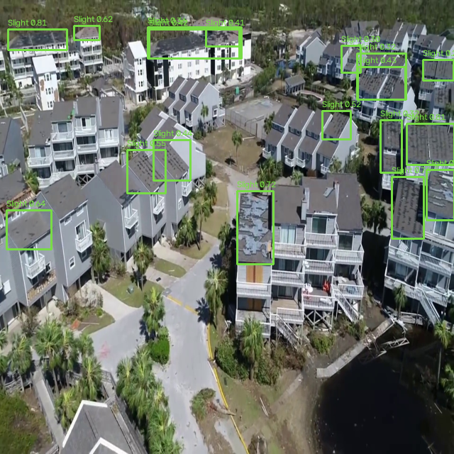
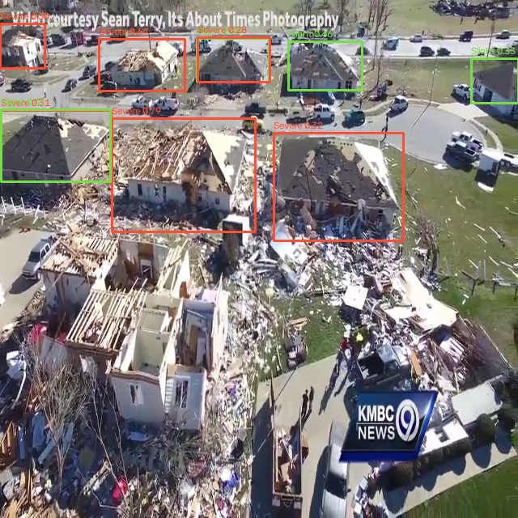
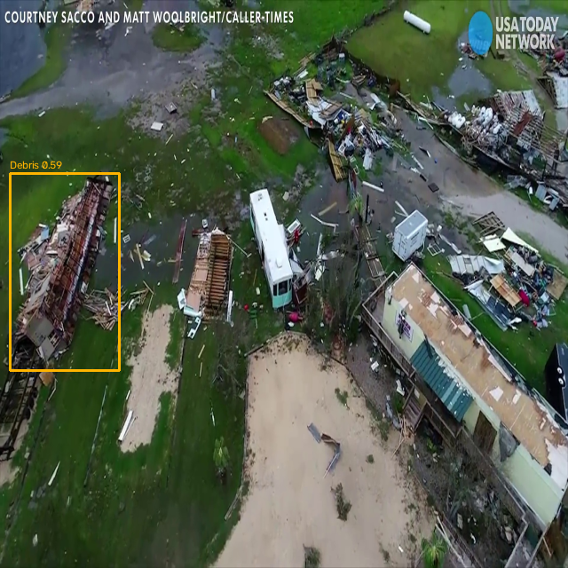
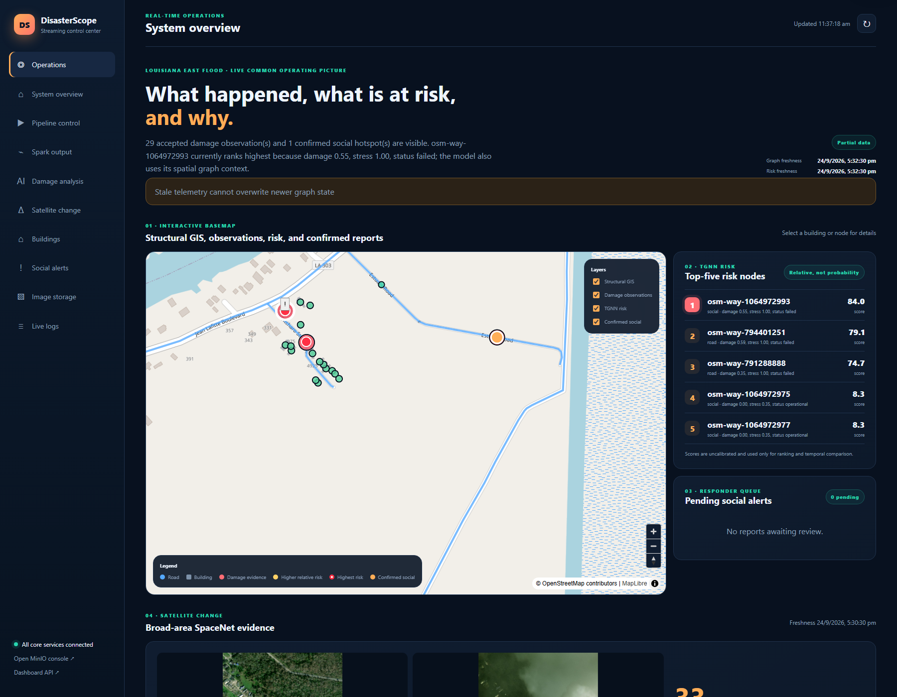
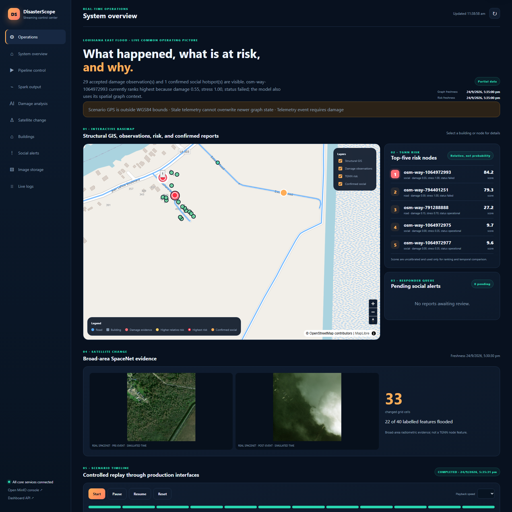

# Results and evaluation

Evaluation date: 2026-09-26  
Scenario: `louisiana-east-flood-v1`  
Branch: `dibsei/baseline-blocker-fixes`

The machine-readable evidence is in
[`results/evaluation_2026-09-26/metrics.json`](../results/evaluation_2026-09-26/metrics.json).
It can be regenerated from retained Kafka, Parquet, MinIO, and committed model
artifacts with:

```powershell
.\.venv\Scripts\python.exe scripts\generate_evaluation_results.py `
  --dashboard-url http://127.0.0.1:8098 `
  --output results\evaluation_2026-09-26\metrics.json
```

## Overall result

The selected scenario traversed the production-shaped interfaces from the
scenario runner through Kafka/MinIO, Spark, checkpoint-backed YOLO and
satellite processing, GIS association, temporal graph updates, checkpoint-
backed TGNN inference, social review, and the dashboard.

The result supports a controlled demonstration, not a field-performance claim.
The source imagery, OSM snapshot, model checkpoints, object storage, Kafka,
Spark, and inference executions were real. Louisiana drone locations,
telemetry, social content, event times, and recovery were simulated.

## YOLO detections

Checkpoint SHA-256:
`780241f6b42f9f0b0d83a8be8d3168e1ca864a756ff93907e72bbb7f9fe3cbf9`.
All results below came from live checkpoint inference with
`prerecorded_output=false`.

| Real ISBDA image | Official annotations | Live output | Confidence range | Producer-to-result |
|---|---|---|---:|---:|
| `5_9240.jpg` | 18 Slight | 18 Slight | 0.284–0.811 | 1.126 s |
| `6_270.jpg` | 6 Severe, 2 Debris | 6 Severe, 4 Slight | 0.281–0.789 | 1.027 s |
| `8_90.jpg` | 1 Severe, 4 Debris | 1 Debris | 0.588 | 19.552 s |

Annotated live outputs:

| Slight selection | Severe selection | Debris selection |
|---|---|---|
|  |  |  |

The per-image count comparison is not an accuracy evaluation: detections were
not matched to ground-truth boxes by IoU in this report. The committed training
artifact reports precision 0.3692, recall 0.2820, mAP50 0.2517, and mAP50–95
0.1087. The low metrics and the visible misses on the severe/debris selections
are material limitations.

## Deduplication

- The retained scenario history contains 20 drone events from repeated runs;
  12 are exact duplicates marked `duplicate_method=sha256`.
- Replayed duplicates retained their canonical image IDs and produced
  `duplicate_skipped` AI records rather than another detection set.
- A new evaluation using real `5_9240.jpg` bytes recompressed the JPEG, changing
  its SHA-256. The persistent deduplicator still matched it through pHash at
  Hamming distance 0 and returned the original canonical ID.
- MinIO contained 21 drone and 22 satellite objects across the wider project.
  These totals include non-scenario assets and must not be interpreted as 43
  unique scenario images.

## Satellite change

The real SpaceNet 8 pair for tile `2_23_44` produced:

- 64/64 valid scored cells;
- 33 changed cells: 24 moderate and 9 severe;
- mean radiometric difference 0.2100 and maximum 0.6885;
- a retained EPSG:4326 footprint from
  `[-90.085531, 29.758316]` to `[-90.079899, 29.763947]`;
- 22 flooded features out of 40 in the official reference data;
- 2.861 s from arrival of the completed image pair to the Kafka change result.

The 33 grid cells and 22 labelled features use different units and are not an
accuracy numerator/denominator. The output is uncalibrated broad-area
radiometric change, not a destruction probability, flood-segmentation score,
or TGNN feature.

## GIS association

All 29 live detections became auditable observations:

| Frame | Observations | Association | GIS source ID | Graph node |
|---|---:|---|---|---:|
| `5_9240.jpg` | 18 | road | `osm-way-791288888` | 2 |
| `6_270.jpg` | 10 | building | `osm-way-1064972993` | 19 |
| `8_90.jpg` | 1 | road | `osm-way-794401251` | 4 |

Observation IDs are the image content hash plus detection index, providing a
trace from graph state back to the image and box. Association behavior was real
code against the frozen OSM geometry, but the GPS coordinates and declared
targets were simulated scenario assignments. This validates traceability and
determinism, not field geolocation accuracy.

## Graph state and TGNN ranking

The graph contained 21 nodes, 322 spatial edges, and zero functional dependency
edges. TGNN used checkpoint
`ad40a02e91cfe414da23f585dcf237d7fd2b5f646f3ebc47c20cb7d73640cc88`
with ordered features `x_pos, y_pos, load, capacity, damage, stress, status`.

Estuary Road (`osm-way-791288888`) changed as follows in the five-snapshot
sequence:

| Stage | Damage | Stress | Status | Relative risk | Rank/21 |
|---|---:|---:|---|---:|---:|
| Baseline | 0.000 | 0.3500 | operational | 0.0242 | 19 |
| First drone observation | 0.243 | 0.5317 | operational | 0.0944 | 1 |
| All drone observations | 0.243 | 0.5313 | operational | 0.1235 | 3 |
| Telemetry degradation | 0.350 | 1.0000 | failed | 0.7631 | 3 |
| Recovery | 0.150 | 0.7018 | operational | 0.2823 | 3 |

Top-three rankings by stage:

| Stage | #1 | #2 | #3 |
|---|---|---|---|
| Baseline | `osm-way-1064972975` 0.0433 | `osm-way-1064972977` 0.0432 | `osm-way-1064972979` 0.0429 |
| First drone | `osm-way-791288888` 0.0944 | `osm-way-1064972975` 0.0599 | `osm-way-1064972977` 0.0598 |
| All drone | `osm-way-1064972993` 0.7948 | `osm-way-794401251` 0.7384 | `osm-way-791288888` 0.1235 |
| Degraded | `osm-way-1064972993` 0.8651 | `osm-way-794401251` 0.8153 | `osm-way-791288888` 0.7631 |
| Recovery | `osm-way-1064972993` 0.8549 | `osm-way-794401251` 0.8030 | `osm-way-791288888` 0.2823 |

Recovery therefore lowered Estuary Road risk by 0.4808 and restored its status,
while the unrecovered severe-image target remained the highest-ranked node.
These are uncalibrated relative scores. A value of 0.7631 does not mean a
76.31% real-world failure probability.

## Cascade and recovery

The Louisiana graph has zero dependency edges. No real cascade occurred, and
the map's spatial high-risk cluster must not be called a confirmed power,
telecom, or road cascade.

The dependency algorithm was separately executed on a synthetic
power → telecom → social fixture. Power failure set both dependents'
dependency factors to 0, stress to 1, and status to failed without inventing
physical damage. Recovery restored all dependency factors to 1, stress to 0.2,
and status to operational. This validates the implementation path only.

## Social/NLP workflow

The current “NLP” layer is deterministic normalization, keyword/pattern
matching, fuzzy landmark lookup, GPS/GIS resolution, deduplication, and human
review. It is deliberately not an LLM or trained general-purpose classifier.

| Decision state | Pending | Confirmed | Rejected | Hotspots | Graph observations |
|---|---:|---:|---:|---:|---:|
| Before review | 1 | 0 | 0 | 0 | 0 |
| Confirmed | 0 | 1 | 0 | 1 | 1 |
| Rejected | 0 | 0 | 1 | 0 | 0 |

The confirmed graph observation is human evidence and does not mutate
structural damage or enter TGNN features.

## Dashboard evidence

Degraded stage, with one confirmed social hotspot and the top-five risk layer:



Recovery stage, including the real SpaceNet images, 33-cell result, complete
timeline, and retained negative-test audit warnings:



The “Partial data” warnings are expected evidence from three deliberately
injected acceptance records: invalid WGS84 GPS, stale telemetry, and telemetry
missing `damage`. Each was quarantined and did not corrupt the recovered graph.

## Latency and counts

Local latency measurements are indicative only; this was one Windows laptop,
not a controlled load test.

| Path | Samples | Result |
|---|---:|---:|
| Drone producer → YOLO result | 3 | 1.027 s, 1.126 s, 19.552 s; median 1.126 s |
| Complete satellite pair → change result | 1 | 2.861 s |
| Spark drone records completed within 60 s | 15 | median 16.477 s, max 23.789 s |
| Spark satellite records completed within 60 s | 10 | median 0.118 s, max 23.186 s |
| Spark AI records completed within 60 s | 16 | median 8.063 s, max 20.831 s |
| Spark social records completed within 60 s | 5 | median 13.810 s, max 23.089 s |
| Dashboard status API | 1 | 0.676 s |
| Dashboard operations API | 1 | 3.360 s |
| Dashboard social API | 1 | 1.647 s |
| Dashboard satellite API | 1 | 1.682 s |

Some replayed Spark records were processed roughly nine hours after their Kafka
timestamps because Spark had been stopped and later resumed. Those backlog
values are evidence of checkpoint recovery, not live latency, and are separated
in `metrics.json`. The dashboard endpoints are slowed by bounded Kafka tail
consumers that intentionally wait up to 1.5 seconds per topic; this is a known
operational bottleneck.

Retained event/object counts at capture time:

| Store/topic | Count |
|---|---:|
| `social-posts` | 46 |
| `drone-video` | 61 |
| `satellite-imagery` | 54 |
| `ai-analysis-results` | 59 |
| `infrastructure-telemetry` | 12 |
| `satellite-change-results` | 2 |
| MinIO drone objects | 21 |
| MinIO satellite objects | 22 |

These are retained-history counts after multiple acceptance replays, not a
single-run throughput measurement. The frozen scenario itself has 12 timeline
milestones and publishes 8 wire records per clean replay: 2 satellite, 3 drone,
1 social, and 2 telemetry records.

## Conclusions by evidence level

### Validated using real data

- The three ISBDA images are real dataset images with registered checksums and
  were processed by the committed YOLO checkpoint.
- Exact SHA-256 and recompressed-image pHash deduplication operated on real
  image bytes.
- The SpaceNet 8 pre/post imagery, reference labels, footprint, and radiometric
  change computation are real dataset-backed inputs and processing.
- The structural map is a frozen real OSM snapshot, and association executed
  against its geometry.
- Kafka, MinIO, Spark/Parquet, checkpoint loading, and dashboard retrieval were
  executed against the actual local stack.

### Demonstrated using simulation

- Drone GPS, Louisiana placement, declared targets, and scenario timestamps.
- Social distress text, social GPS, responder decisions, and resulting hotspot.
- Road degradation and recovery telemetry.
- Graph-state evolution and TGNN ranking over the hybrid real-evidence/
  simulated-context sequence.
- Pause, resume, reset, playback speed, negative-event quarantine, and complete
  scenario replay.

### Architecturally supported but not field-tested

- Ingestion from physical drones, satellites, sensors, or a live social API.
- Accurate telemetry-derived drone geolocation and camera-footprint projection.
- Functional infrastructure cascades on a real dependency graph; the scenario
  has no dependency edges and only a synthetic fixture exercises propagation.
- TGNN probability calibration, operational alert thresholds, and predictive
  accuracy on labelled Louisiana failures.
- General NLP understanding of noisy multilingual social media; the current
  resolver is narrow and deterministic.
- Multi-node deployment, sustained throughput, fault tolerance beyond local
  checkpoint replay, authentication/authorization, and production security.

## Known weaknesses and unsupported claims

- YOLO validation metrics are low, and selected-image outputs visibly miss or
  misclassify some official damage annotations.
- The three selected images are not an independent test set for this report;
  do not present the count comparison as precision, recall, or mAP.
- TGNN was trained on synthetic graphs and has no Louisiana calibration set.
- Satellite radiometric change does not identify destroyed buildings and is
  intentionally excluded from TGNN features.
- Simulated Louisiana GPS cannot establish that ISBDA damage occurred at those
  OSM objects.
- The highest-risk cluster is model-derived spatial context, not a confirmed
  physical cascade.
- Social confirmation proves workflow behavior, not report truth or NLP model
  accuracy.
- Latencies are single-run local observations with service scheduling,
  micro-batching, and replay backlog effects; they are not an SLA.
- Dashboard Kafka-tail reads are too slow for a high-rate production control
  room and should be replaced with indexed materialized state or a serving DB.
