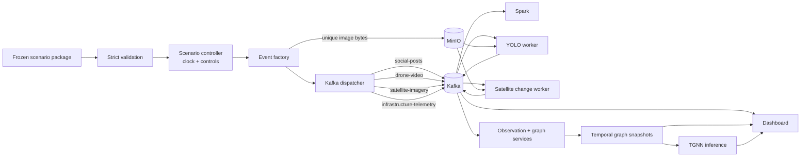
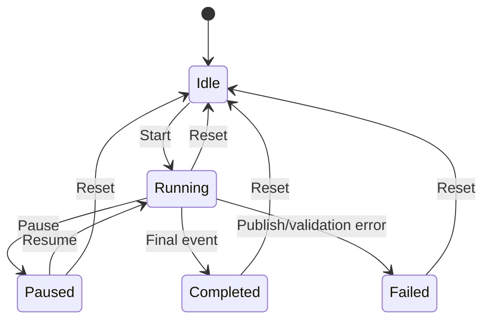

# How the Disaster Simulation Works — PPT Guide

## Purpose

This document explains how the Louisiana flood simulation is controlled, how
events are released over simulated time, and how those inputs become visible
through the real processing pipeline. The sections are designed to be reused as
presentation slides.

The core idea is:

> The simulation controls **when source evidence arrives**. It does not insert
> prepared AI predictions, graph states, risk scores, or dashboard results.
> Those outputs must still be produced by the normal system components.

---

## Slide 1 — What is being simulated?

The frozen scenario represents a flood and infrastructure disruption in:

- **Location:** Jean Lafitte, Jefferson Parish, Louisiana, USA
- **Coordinate system:** WGS84 / `EPSG:4326`
- **Scenario ID:** `louisiana-east-flood-v1`
- **Start time:** `2026-09-24T12:00:00Z`
- **Duration:** 330 simulated seconds, or 5 minutes 30 seconds
- **Structural network:** 5 roads and 16 buildings
- **Graph:** 21 nodes and 322 spatial edges

The simulation tells a controlled story: establish the baseline, observe
flood-related change and damage, receive a distress report, degrade a road,
calculate infrastructure risk, then model partial recovery.

### Suggested narration

“We use a short, repeatable timeline to demonstrate how multiple evidence
sources affect a common disaster operating picture.”

---

## Slide 2 — Real evidence versus simulated context

The scenario deliberately combines real datasets with simulated operational
context.

| Item | Real or simulated? | Explanation |
| --- | --- | --- |
| Louisiana roads and buildings | Real snapshot | Frozen OpenStreetMap-derived GIS for the selected boundary |
| SpaceNet pre/post images | Real imagery | Real SpaceNet 8 tile `2_23_44` covering the scenario area |
| SpaceNet flood labels | Real dataset labels | 22 flood-labelled features out of 40 reference features |
| Three ISBDA drone images | Real imagery | Real disaster images selected for Slight, Severe, and Debris evidence |
| Drone location in Louisiana | Simulated | ISBDA does not establish that these images were captured in this Louisiana tile |
| Drone target IDs | Simulated | Assigned so the demo can exercise GIS association and graph updates |
| Event timestamps | Simulated | Used to create the ordered five-and-a-half-minute story |
| Social distress report | Simulated | Written for the scenario and requires responder review |
| Telemetry degradation/recovery | Simulated | Demonstrates infrastructure-state changes |
| YOLO detections | Real model execution | Produced live by the committed checkpoint, not prerecorded |
| Graph calculations | Real code execution | Derived from accepted observations and telemetry |
| TGNN scores | Real checkpoint execution | Model-generated relative risk scores, not calibrated probabilities |

This combination is labelled **mixed provenance** in the dashboard.

---

## Slide 3 — Simulation architecture



### Component responsibilities

- **Scenario package:** declares assets, checksums, provenance, target IDs, and
  the expected timeline.
- **Controller:** maintains simulated time and decides when an event is due.
- **Event factory:** converts frozen assets into normal producer event schemas.
- **Dispatcher:** publishes only source events to the appropriate Kafka topic.
- **Downstream services:** independently generate detections, change evidence,
  graph state, risk scores, and dashboard views.

### Key PPT point

> The runner behaves like a controlled replacement for field devices, not a
> replacement for the processing pipeline.

---

## Slide 4 — What is inside the scenario package?

The package is stored under `scenarios/louisiana_east_flood/` and contains:

| File or folder | Purpose |
| --- | --- |
| `scenario.json` | Scenario identity, location, asset registry, provenance, and bindings |
| `timeline.json` | Ordered 12-step story with timestamps and expected effects |
| `expected_results.json` | Acceptance expectations used during validation |
| `gis/infrastructure.geojson` | Frozen roads and buildings for the selected location |
| `satellite/pair.json` | SpaceNet pre/post image paths, footprints, and reference counts |
| `drone/selection.json` | Three selected ISBDA images and checksums |
| `drone_events.json` | Assigned GPS positions, targets, and scenario times |
| `social_events.json` | Simulated distress-report definition |
| `responder_decisions.json` | Expected responder-decision definition |
| `telemetry.json` | Degradation and recovery readings |

Every registered asset states:

- its original dataset and path;
- SHA-256 checksum;
- whether the input is real or simulated;
- which fields were simulated;
- scenario timestamp;
- geographic footprint or assigned location.

---

## Slide 5 — Validation before playback

When **Start** is pressed for the first time, the dashboard service does not
immediately publish events. It first runs strict scenario validation.

Validation checks include:

1. Required scenario files exist.
2. Registered SHA-256 checksums match.
3. External SpaceNet and ISBDA source files are available.
4. The SpaceNet footprint matches the scenario area.
5. GIS identifiers and scenario target bindings are valid.
6. Real and simulated fields are declared honestly.
7. Timeline timestamps and offsets are consistent.
8. The expected event contracts are complete.

If strict validation fails, playback does not start. This prevents a broken or
misrepresented scenario package from silently entering the demo.

---

## Slide 6 — The simulation clock

Each timeline event has an `offset_seconds` value measured from the scenario
start. The controller continuously calculates:

```text
simulated elapsed time
  = saved position
  + real elapsed time × playback speed
```

Examples for the full 330-second story:

| Playback speed | Approximate real duration |
| ---: | ---: |
| 1× | 5 min 30 sec |
| 2× | 2 min 45 sec |
| 5× | 1 min 6 sec |
| 10× | 33 sec |
| 100× | 3.3 sec |

The speed can be changed while the scenario is running. The controller first
saves the current simulated position, then applies the new speed, so the clock
does not jump backward or lose elapsed time.

---

## Slide 7 — Playback controls and state

The controller has five states:



### Controls

- **Start:** validates the package and begins the background timeline.
- **Pause:** freezes simulated time and stops new events from becoming due.
- **Resume:** continues from the exact saved simulated position.
- **Reset:** returns the controller to time zero and marks all events upcoming.
- **Playback speed:** changes the simulated-time multiplier.

The dashboard also shows:

- current scenario timestamp;
- current event;
- completed events;
- upcoming events;
- error state, if publishing fails.

---

## Slide 8 — The 12-step disaster story

| Step | Simulated time | What happens | Main visible result |
| ---: | --- | --- | --- |
| 1 | 12:00:00 | Baseline GIS graph is loaded | Roads and buildings appear with baseline state |
| 2 | 12:00:30 | SpaceNet pre/post pair arrives | Broad-area satellite change panel appears |
| 3 | 12:01:00 | First drone image arrives | Slight-damage YOLO observations appear for Estuary Road |
| 4 | 12:01:30 | Two more drone images arrive | Severe and Debris evidence appears for assigned targets |
| 5 | 12:02:00 | Social distress report arrives | Report appears as pending review |
| 6 | 12:02:15 | Responder decision point | Operator confirms or rejects the report |
| 7 | 12:02:30 | Road telemetry degrades | Higher load/damage evidence appears |
| 8 | 12:03:00 | Graph state is updated | Damage, capacity, utilization, stress, and status change |
| 9 | 12:03:30 | TGNN recalculates risk | Node-risk layer and top-five ranking appear |
| 10 | 12:04:00 | Spatial risk pattern is shown | High-risk neighboring nodes are emphasized |
| 11 | 12:05:00 | Recovery telemetry arrives | Estuary Road load and damage decrease |
| 12 | 12:05:30 | TGNN recalculates after recovery | Risk ranking and before/after deltas refresh |

---

## Slide 9 — Which timeline steps publish data?

Not every timeline milestone creates a Kafka message.

### Source-input milestones

The runner publishes these inputs:

| Timeline event | Kafka output |
| --- | --- |
| Satellite change event | 2 records to `satellite-imagery`: pre and post |
| First drone event | 1 record to `drone-video` |
| Severe-damage event | 2 records to `drone-video` |
| Social distress event | 1 record to `social-posts` |
| Telemetry degradation | 1 record to `infrastructure-telemetry` |
| Recovery event | 1 record to `infrastructure-telemetry` |

A clean replay therefore publishes eight source records.

### Derived milestones

These steps do not inject a prepared result:

- baseline graph display;
- responder decision point;
- graph-state update;
- TGNN inference;
- risk-cluster visualization;
- post-recovery risk refresh.

They identify when downstream behavior is expected. The graph, model, and
dashboard services must derive the result from the source evidence already
received.

---

## Slide 10 — How image events are created

The scenario runner reuses the normal drone and satellite producer functions.

### Drone event

1. Read the selected real ISBDA image.
2. Run SHA-256 and pHash deduplication.
3. Upload a unique image to MinIO or mark it as a duplicate.
4. Build the normal `drone-video` event.
5. Add scenario provenance:
   - scenario ID;
   - event ID;
   - simulated scenario timestamp;
   - simulated GPS;
   - simulated target ID;
   - real-image origin.
6. Publish to Kafka.

### Satellite event

1. Read the real SpaceNet TIFF.
2. Convert it to a streamable JPEG.
3. Deduplicate and store unique bytes.
4. Add pre/post phase, tile ID, WGS84 bounding box, and reference-label count.
5. Explicitly identify only the scenario timestamp as simulated.
6. Publish the pre and post records to Kafka.

Because the same functions are used, downstream consumers cannot distinguish
scenario input from normal producer input by transport or schema alone. They
can distinguish it through the explicit provenance fields.

---

## Slide 11 — What happens after each source event?

### Satellite path

```text
Runner -> satellite-imagery -> MinIO/Kafka
       -> satellite change worker
       -> satellite-change-results
       -> broad-area dashboard evidence
```

The satellite result remains separate from TGNN node features.

### Drone path

```text
Runner -> drone-video -> MinIO/Kafka
       -> YOLO checkpoint inference
       -> ai-analysis-results
       -> GIS association
       -> accepted damage observations
       -> graph snapshots
```

### Social path

```text
Runner -> social-posts
       -> incoming/pending review
       -> responder confirms or rejects
       -> confirmed hotspot or audit-only rejection
```

### Telemetry path

```text
Runner -> infrastructure-telemetry
       -> contract validation
       -> target lookup
       -> temporal graph-state update
```

---

## Slide 12 — Human decision in the simulation

The distress report is intentionally not auto-confirmed.

At the responder-decision stage, the dashboard operator should either:

- press **Confirm**, which creates an orange hotspot and an auditable
  human-evidence observation; or
- press **Report false**, which keeps the report in the audit history but does
  not affect confirmed state.

Pending reports do not become confirmed hotspots automatically. Confirmation
also does not directly change structural damage or TGNN features.

### Recommended live-demo action

Run at 5× or 10× speed, pause when the report becomes pending, demonstrate the
Confirm/Reject choice, then resume playback.

---

## Slide 13 — Graph state and risk are derived, not injected

The baseline graph remains unchanged as a reference. The system creates
time-specific copies called snapshots.

Accepted evidence updates snapshot features such as:

- damage;
- load;
- effective capacity;
- utilization;
- stress;
- operational status;
- observation timestamp and freshness.

Ordered snapshots are converted into normalized PyTorch Geometric tensors and
passed to the committed TGNN checkpoint. The model emits one finite relative
risk score per node, and stable ordering maps each tensor row back to its
original GIS node ID.

The runner does not create these values. It only advances the clock and sends
the evidence that triggers their calculation.

---

## Slide 14 — Recovery behavior

At 12:05:00, simulated recovery telemetry updates Estuary Road:

- load decreases from `0.72` to `0.44`;
- explicit damage decreases from `0.35` to `0.15`;
- effective capacity, utilization, stress, and status are recalculated;
- graph topology remains unchanged.

At 12:05:30, TGNN inference runs against the ordered sequence including the
recovery snapshot. The dashboard compares the refreshed risk scores with the
earlier degraded stage.

Recovery is therefore shown as a new evidence-backed state, not as deletion of
the earlier failure evidence.

---

## Slide 15 — Reset and replay behavior

**Reset rewinds the simulation controller; it does not erase infrastructure
history.**

After reset:

- simulated time returns to 12:00:00;
- completed/upcoming event lists are reset;
- in-memory social review state is reset;
- retained Kafka records still exist;
- MinIO objects still exist;
- Spark Parquet files and checkpoints still exist;
- the persistent deduplication registry still knows previously seen images.

On replay, identical images may produce `duplicate_skipped` records pointing to
their canonical images. This is expected behavior and proves that repeated
playback does not needlessly store or analyze identical bytes again.

The dashboard projects retained scenario history against the current simulated
time so future-stage evidence is hidden while a replay progresses.

### Key PPT point

> Reset means “rewind the story,” not “delete the audit trail.”

---

## Slide 16 — Failure behavior

If validation, asset loading, MinIO upload, or Kafka publishing fails:

1. the current event is not marked complete;
2. the controller enters the `failed` state;
3. the error is exposed through scenario status;
4. a newly registered image fingerprint is rolled back if delivery failed;
5. the user can correct the service/configuration problem and reset the run.

The controller sorts events by offset and rejects invalid timelines with
negative, repeated, or unordered offsets. This protects the deterministic event
sequence.

---

## Slide 17 — Recommended live demonstration

### Before starting

1. Start ZooKeeper, Kafka, and MinIO.
2. Create the Kafka topics.
3. Start Spark.
4. Start the YOLO worker.
5. Start the satellite change worker.
6. Open the operational dashboard.

### During playback

1. Set speed to 5× or 10×.
2. Press **Start**.
3. Point out the baseline GIS map.
4. Show the real SpaceNet pre/post evidence.
5. Show live YOLO detections from the three real ISBDA images.
6. Pause at the pending social alert.
7. Confirm or reject it and explain the distinct behavior.
8. Resume and show telemetry degradation.
9. Show the before/after graph-state difference.
10. Explain the top-five TGNN ranking as relative, uncalibrated risk.
11. Show recovery and the refreshed risk ranking.

### Recommended statement

“The runner only controls the arrival of inputs. Every detection, association,
state update, and model score shown here is generated by the running pipeline.”

---

## Slide 18 — Claims the presentation should avoid

Do not claim that:

- the ISBDA drone images were captured in Louisiana;
- simulated GPS represents real drone telemetry;
- the social message came from a real Louisiana resident;
- simulated load and damage values came from field sensors;
- satellite radiometric change proves that a specific building was destroyed;
- TGNN scores are calibrated failure probabilities;
- the risk cluster proves a real power or telecom cascade.

Safe claims are:

- real images passed through real ingestion and model code;
- scenario context and operational events were explicitly simulated;
- source-to-Kafka-to-processing contracts were exercised end to end;
- accepted observations were traceable to exact GIS and graph nodes;
- graph and risk changes were generated by the implemented code;
- the scenario is a reproducible system demonstration, not a field-validation
  study.

---

## One-slide summary

```text
Frozen, validated scenario package
              ↓
Speed-controlled simulated clock
              ↓
Production-shaped source events
              ↓
Kafka metadata + MinIO image bytes
              ↓
Spark / YOLO / satellite / social / GIS processing
              ↓
Temporal graph snapshots
              ↓
TGNN relative risk and operational dashboard
```

The simulation is reproducible because the asset checksums, event order,
timestamps, target bindings, and expected effects are frozen. It is realistic
at the interface level because it uses the same event contracts as normal
producers, while remaining honest about which evidence is real and which
operational context is simulated.
