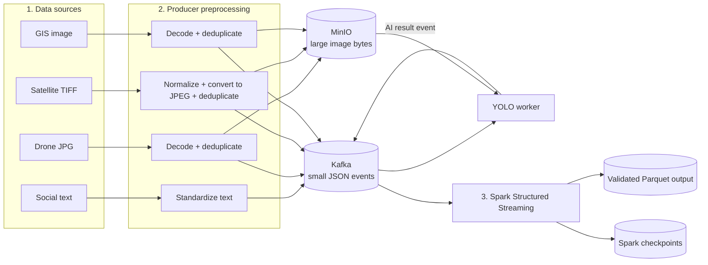

# Upstream Data and Preprocessing Architecture — PPT Guide

## Purpose

This document explains the system from the original data sources up to the
Spark layer. It is written in simple terms so that its sections can be copied
into presentation slides.

The main idea is:

> Different kinds of disaster data are converted into small, consistent
> events. Large image files are stored in MinIO, event metadata is carried by
> Kafka, and Spark validates and organizes the streams into durable Parquet
> output.

---

## Slide 1 — What enters the system?

The upstream layer handles several types of disaster information:

| Data type | Current source | What it represents |
| --- | --- | --- |
| Social text | CrisisMMD TSV records or a simulated scenario report | A message describing possible distress or disaster conditions |
| Drone imagery | Real ISBDA JPG images | Close-range visual evidence of slight damage, severe damage, or debris |
| Satellite imagery | xBD TIFF images in the general producer; a real SpaceNet 8 pre/post pair in the frozen scenario | Broad-area imagery before or after a disaster |
| GIS map imagery | JPG, JPEG, or PNG files | Map-image events carried through the generic ingestion pipeline |
| Structural GIS | Frozen OpenStreetMap-derived GeoJSON | The actual roads and buildings used to construct the scenario graph |
| Infrastructure telemetry | Simulated scenario events | Load, capacity, and damage readings for a road or infrastructure target |
| AI detection results | Output from the committed YOLO worker | Damage class, confidence, bounding box, and image provenance |

Important distinction: the source imagery is real dataset imagery, but the
Louisiana drone coordinates, scenario timestamps, telemetry, and scenario
social report are simulated. The system preserves this provenance.

### Suggested narration

“The platform accepts text, images, map information, sensor-like readings, and
AI results. Each source has different preparation requirements, but all events
are given a stable structure before downstream processing.”

---

## Slide 2 — High-level architecture



### Architecture in basic terms

- **Producers** act as adapters. They read each original dataset and turn its
  records into a common event format.
- **MinIO** stores large image bytes, similar to a private S3 bucket.
- **Kafka** carries small event messages and image references in real time.
- **Spark** reads the Kafka streams, checks their structure, cleans selected
  fields, adds processing metadata, and writes queryable Parquet files.

### Suggested narration

“Kafka is the event highway, MinIO is the image warehouse, and Spark is the
stream-cleaning and organization layer.”

---

## Slide 3 — Two upstream operating modes

The system can receive events in two ways:

### Dataset replay mode

Normal producers recursively read configured folders and slowly publish
records. This simulates information arriving from field systems over time.

- Social producer reads CrisisMMD TSV files.
- Drone producer reads ISBDA JPG/JPEG files.
- Satellite producer reads TIFF files, such as xBD imagery.
- GIS producer reads JPG/JPEG/PNG map imagery.

### Frozen scenario mode

The scenario runner publishes a fixed Louisiana flood story:

- one real SpaceNet 8 pre/post satellite pair;
- three real ISBDA drone images;
- one simulated social distress report;
- two simulated telemetry readings.

The runner uses the same producer functions and Kafka contracts as normal
ingestion. Downstream consumers therefore receive production-shaped events
rather than dashboard-only demo records.

### Key PPT point

> The scenario runner changes where the input comes from, not the interface
> through which downstream services receive it.

---

## Slide 4 — Social-text preprocessing

### Input

- CrisisMMD rows stored in tab-separated (`.tsv`) files, or a scenario report
  shaped like the same social event.

### Producer preprocessing

1. Find TSV files recursively.
2. Read each row as text.
3. Extract a stable post ID and message text.
4. Skip rows with a missing ID or empty message.
5. Standardize the fields to:
   `id`, `text`, `hazard`, `event`, `timestamp`, `source`, and `data_type`.
6. Publish the JSON event to Kafka topic `social-posts`.

Social text is small, so it does not need MinIO.

### Spark preprocessing

1. Parse JSON using an explicit social-event schema.
2. Reject records without an ID or usable text.
3. Convert text to lowercase.
4. Replace repeated whitespace and trim the result.
5. Check whether configured disaster keywords appear.
6. Convert the Unix timestamp into a readable event timestamp.
7. Add Spark processing time and Kafka lineage fields.
8. Write the clean output to `storage/processed/social/`.

Spark also produces simple counts grouped by event and hazard. These counts
are descriptive analytics, not an NLP or truth-classification model.

### Simple example

```text
Original:   "  URGENT:  Road FLOODED near the bridge  "
Normalized: "urgent: road flooded near the bridge"
Keyword:    true
```

---

## Slide 5 — Drone-image preprocessing

### Input

- Real ISBDA JPG/JPEG images.

### Producer preprocessing

1. Discover JPG/JPEG files recursively.
2. Read the original image bytes.
3. Decode the image with OpenCV to confirm it is usable.
4. Calculate a SHA-256 content hash.
5. Calculate a perceptual hash (pHash) for configured near-duplicate checking.
6. Compare the hashes with the persistent SQLite deduplication registry.
7. For a new image, store the bytes in MinIO and send its reference to Kafka.
8. For a duplicate, do not upload the image again; send a small event pointing
   to the canonical image.
9. Publish the event to Kafka topic `drone-video`.

### Why two hashes?

- **SHA-256** detects an exact byte-for-byte duplicate.
- **pHash** detects an image that looks the same even if it was recompressed or
  resized slightly.

The first accepted image becomes the canonical copy. Drone pHash comparison is
enabled because consecutive or retransmitted drone frames can be visually
identical.

### Spark preprocessing

1. Parse the event with the drone schema.
2. Require a frame ID, `source=drone`, and JPG/JPEG format.
3. Require either a valid image reference/Base64 payload or a duplicate flag.
4. Mark unique images as `ready_for_ai`.
5. Mark duplicate events as `duplicate_skipped`.
6. Remove the large Base64 field from Spark output.
7. Preserve the content hash, MinIO key, duplicate lineage, timestamps, and
   Kafka topic/partition/offset.
8. Write metadata to `storage/processed/drone/`.

### Key PPT point

> Spark stores useful image metadata, not another copy of every image.

---

## Slide 6 — Satellite-image preprocessing

### Input

- TIFF satellite images.
- The frozen scenario uses a real SpaceNet 8 pre/post pair for tile `2_23_44`.

### Producer preprocessing

1. Discover `.tif` and `.tiff` files.
2. Decode the TIFF with OpenCV.
3. Normalize non-8-bit pixel values to the range 0–255.
4. Convert grayscale or four-channel imagery into a standard three-channel
   image when required.
5. Compress the result as JPEG for efficient streaming and browser display.
6. Calculate SHA-256 and deduplication metadata.
7. Upload unique JPEG bytes to MinIO.
8. Publish the metadata/reference event to `satellite-imagery`.

Satellite pHash suppression is disabled by default. A small visual difference
between pre-event and post-event images may be the disaster signal, so it must
not be removed as a near duplicate.

### Spark preprocessing

1. Parse with the satellite schema.
2. Require a satellite image ID.
3. Verify that the original format is TIFF and the stream format is JPEG.
4. Verify that the event contains an image reference, Base64 data, or valid
   duplicate metadata.
5. Mark the record `ready_for_ai` or `duplicate_skipped`.
6. Remove large Base64 content from the durable Spark output.
7. Preserve MinIO reference, checksum, size, timestamps, and Kafka lineage.
8. Write metadata to `storage/processed/satellite/`.

### Separate broad-area analysis branch

The satellite change worker also reads `satellite-imagery`, pairs the SpaceNet
pre/post records, and publishes coarse change evidence to
`satellite-change-results`. That result is displayed on the dashboard but is
not currently consumed by Spark and is not a TGNN feature.

---

## Slide 7 — GIS data: two different roles

The term “GIS” refers to two separate inputs in the current codebase.

### GIS image stream

The generic GIS producer:

1. reads JPG, JPEG, or PNG map images;
2. decodes and deduplicates them;
3. stores unique bytes in MinIO;
4. publishes references to `gis-data`;
5. lets Spark validate the map ID and source, attach timestamps and processing
   status, and write `storage/processed/gis/`.

### Structural GIS snapshot

The Louisiana scenario’s roads and buildings come from a frozen
OpenStreetMap-derived GeoJSON file. It is loaded directly by the GIS/graph
services to preserve stable source IDs and geometry.

It does **not** currently travel through the `gis-data` Spark image stream.
This distinction should be stated clearly in the presentation.

### Suggested narration

“The GIS image topic demonstrates streaming map-media ingestion. The actual
structural graph uses a frozen GeoJSON snapshot so that road and building IDs
remain stable throughout the scenario.”

---

## Slide 8 — MinIO and Kafka: why both are needed

| Component | Stores/carries | Why it is used |
| --- | --- | --- |
| MinIO | Large drone, satellite, and GIS image bytes | Avoids putting large binary files inside every Kafka message |
| Kafka | Small JSON events, references, timestamps, hashes, and provenance | Decouples producers from consumers and preserves ordered event streams |

### Preferred object-storage flow

```text
Image bytes
  -> SHA-256 content key
  -> MinIO object: satellite/e1/<hash>_image.jpg
  -> Kafka event: object key + URI + checksum + metadata
```

The system also supports Base64 for simple testing. Base64 places the encoded
image inside the JSON event, but it is less efficient because it increases the
payload size and forces Kafka and Spark to handle unnecessary image text.
Object-storage mode is the recommended architecture.

### Reliability details

- Kafka producers request acknowledgements from all required replicas and
  retry failed sends.
- Kafka records include partition and offset information.
- MinIO uses content-addressed object names based on SHA-256.
- If a new image fails to publish, its premature deduplication registration is
  rolled back so the event can be retried correctly.

---

## Slide 9 — YOLO results returning to Spark

The YOLO worker forms a processing branch between ingestion and Spark:

```text
drone-video event + MinIO image
  -> YOLO checkpoint inference
  -> class + confidence + bounding box + provenance
  -> ai-analysis-results Kafka topic
  -> Spark AI processor
  -> storage/processed/ai/
```

Spark validates and preserves:

- frame and source references;
- model name and checkpoint SHA-256;
- live-inference provenance;
- scenario timestamp;
- GPS and GPS provenance;
- declared target association;
- detection count and maximum confidence;
- per-detection class, confidence, and bounding box;
- Kafka and processing timestamps.

Spark does not run YOLO itself. It consumes the result events produced by the
separate AI worker.

---

## Slide 10 — What Spark does

Spark Structured Streaming subscribes to five Kafka topics:

1. `social-posts`
2. `drone-video`
3. `satellite-imagery`
4. `gis-data`
5. `ai-analysis-results`

For every Kafka message, Spark first keeps:

- the JSON value;
- topic name;
- partition number;
- offset;
- Kafka timestamp.

It then separates the combined stream by topic and applies a dedicated schema
and processor for each data type.

### Spark outputs

| Stream | Durable output |
| --- | --- |
| Social | `storage/processed/social/` |
| Drone metadata | `storage/processed/drone/` |
| Satellite metadata | `storage/processed/satellite/` |
| GIS image metadata | `storage/processed/gis/` |
| AI results | `storage/processed/ai/` |

Spark writes append-only Parquet files and maintains checkpoints under
`storage/checkpoints/<stream>/`. A checkpoint remembers how far a query has
read so the same stream can continue after a normal restart.

The same cleaned records are also printed to the Spark console for live
demonstration and debugging.

---

## Slide 11 — What does not pass through Spark today?

This boundary is important for an accurate architecture presentation.

- `infrastructure-telemetry` goes directly to the graph-state workflow.
- `satellite-change-results` goes to the dashboard as broad-area evidence.
- The frozen structural GIS GeoJSON is loaded directly by GIS/graph services.
- Social confirmation/rejection is handled by the review workflow.
- Graph snapshots and TGNN inference happen after the ingestion/Spark layer.

Therefore, Spark is the durable validation and preprocessing layer for five
event families. It is not the central processor for every later feature.

---

## Slide 12 — End-to-end example

### Example: one new drone image

1. The producer reads `5_9240.jpg` from the ISBDA dataset.
2. OpenCV confirms that it can be decoded.
3. SHA-256 and pHash are calculated.
4. The deduplicator decides whether it is new or already known.
5. If new, the JPEG bytes are uploaded once to MinIO.
6. A small JSON event containing the MinIO key and provenance is sent to
   `drone-video`.
7. Spark validates the event and stores clean metadata as Parquet.
8. In parallel, the YOLO worker downloads the image and performs inference.
9. The YOLO result is sent to `ai-analysis-results`.
10. Spark validates and stores the AI result as a second Parquet stream.

### One-sentence summary for the slide

> Store large data once, stream small references, validate every modality, and
> preserve enough metadata to trace each result back to its original evidence.

---

## Recommended terminology for the presentation

| Term | Simple explanation |
| --- | --- |
| Upstream | Everything that happens before the main processing layer |
| Producer | A program that converts a source file or device reading into an event |
| Event | One timestamped JSON message describing new information |
| Topic | A named Kafka stream for one type of event |
| Object storage | Storage for large files addressed by a key; MinIO is the local S3-compatible implementation |
| Deduplication | Preventing the same or visually equivalent image from being stored and processed repeatedly |
| Schema | The expected fields and data types for an event |
| Kafka lineage | Topic, partition, offset, and timestamp showing exactly where a record came from |
| Parquet | A compact analytics-friendly file format written by Spark |
| Checkpoint | Spark’s saved progress for a streaming query |
| Provenance | Information explaining which parts are real, simulated, or model-derived |

---

## Final architecture message

The upstream design separates three concerns:

1. **Data preparation:** each producer understands its own source format.
2. **Transport and storage:** Kafka moves events while MinIO stores large
   image bytes.
3. **Stream preprocessing:** Spark enforces schemas, filters invalid records,
   normalizes data, preserves lineage, and writes durable Parquet output.

This separation allows the same downstream processing to receive either replayed
datasets, frozen scenario events, or future field-device events without changing
the core event contracts.
